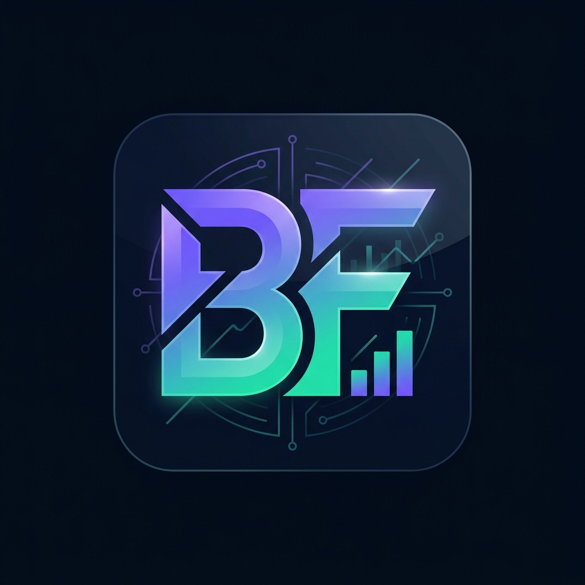

<div align="center">

<!-- ═══════════════  ANIMATED HERO BANNER  ═══════════════ -->




<br/>

<!-- Typing SVG animation -->
<a href="https://blackfriday9171.streamlit.app/">
  
</a>

<br/><br/>

<!-- Primary CTA badges -->
[](https://blackfriday9171.streamlit.app/)
[](https://github.com/Ankit4981/IDAI102-100390-BlackFriday)
[](https://drive.google.com/drive/folders/1w5GZmtaQzhZGNBo7vK8M8-FJNS8jsQEI?usp=sharing)

<br/>

<!-- Tech stack badges -->


<br/>

<!-- Activity badges -->

[](https://github.com/Ankit4981/IDAI102-100390-BlackFriday)
[](https://github.com/Ankit4981/IDAI102-100390-BlackFriday)


</div>

---

<!-- Animated wave divider -->


## 🌟 Overview

**Black Friday AI Dashboard** is a production-grade data mining application that transforms **550,000+ Black Friday retail transactions** into actionable business intelligence — with a premium glassmorphism UI, real ML algorithms, and live interactive visualisations running entirely in the browser.

> 💡 **Try it instantly** → email: `demo@blackfriday.ai` · password: `demo123`

<br/>

## ⚡ Feature Modules

<div align="center">

</div>

<br/>

<table>
<tr>
<td width="50%">

### 🏠 Dashboard Overview
- **6 live KPI cards** — revenue, basket, users, products, missing %, gender split
- Animated welcome banner with dataset source badge
- Real-time row count and data freshness indicator

### 📊 Exploratory Data Analysis
8 interactive Plotly charts with sidebar filters:

| Chart | Insight |
|---|---|
| 📈 Purchase Histogram | Spend distribution + mean line |
| 📦 Age Box Plot | IQR spread per cohort |
| 🏷️ Category Bar | Top 15 SKU popularity |
| 🍩 Gender Donut | M/F purchase split |
| 🏙️ City Revenue Bar | A/B/C performance |
| 🔥 Correlation Heatmap | Feature relationships |
| 👤 Age Revenue Bar | Revenue by cohort |
| 💼 Occupation Scatter | Spend by occupation |

</td>
<td width="50%">

### 🎯 Customer Segmentation (K-Means)
- **Elbow method** — optimal *k* up to 10 clusters
- Auto-ranked labels: 💰 Budget → 💎 Diamond Buyers
- Cluster scatter, distribution bar, purchase box-plot
- Per-cluster **profile cards** with demographics

### 🛒 Market Basket Analysis (Apriori)
- `mlxtend` Apriori with graceful co-occurrence fallback
- Configurable support & confidence sliders
- Lift-ranked rules table + bubble scatter + itemset bar

### 🚨 Anomaly Detection
- **IQR** and **Z-Score** methods (configurable σ threshold)
- Labels: `Normal` / `High Spender` / `Suspicious Low`
- Star-marker scatter + anomaly donut + Z-score histogram

### 💡 AI Insights Engine
- Auto-generated insight cards tied to live data
- 6 strategic recommendations with metric callouts

</td>
</tr>
</table>

<br/>

<!-- Animated snake / wave divider -->


## 🛠️ Tech Stack

<div align="center">


<br/><br/>

| Layer | Technology |
|:---:|:---|
| 🖥️ **Frontend** | Streamlit · Custom CSS Glassmorphism · Bricolage Grotesque · DM Sans |
| 📊 **Visualisation** | Plotly Express · Plotly Graph Objects (20+ chart types) |
| 🤖 **Clustering** | Scikit-learn — `KMeans` + `StandardScaler` |
| 🛒 **Assoc. Rules** | mlxtend — `apriori` + `association_rules` |
| 🚨 **Anomalies** | SciPy — Z-Score · IQR method |
| 🔢 **Data Layer** | Pandas 2.0 · NumPy |
| 🔐 **Auth** | SHA-256 hashing · JSON store · Streamlit session state |
| 📦 **Deploy** | Streamlit Community Cloud |

</div>

<br/>

## 📁 Project Structure

```
📦 BlackFriday/
│
├── 🐍 app.py               ← Main Streamlit entry point & all page routing
├── 🔐 auth.py              ← Login / Signup glassmorphism UI + SHA-256 auth
├── 🤖 analytics.py         ← KMeans · Apriori · Anomaly detection logic
├── 📊 charts.py            ← 20+ Plotly chart functions (all themes unified)
├── 💾 data_loader.py       ← CSV loading · cleaning · synthetic fallback
├── 🎨 styles.py            ← CSS injection · KPI cards · section headers
│
├── 📄 BlackFriday.csv      ← Kaggle dataset (550K+ rows)
├── 🖼️  logo.png             ← App logo (auth + sidebar)
├── 👤 users.json           ← Auth store (auto-created on first run)
└── 📋 requirements.txt     ← Python dependencies
```

<br/>

<!-- Animated divider -->


## 🚀 Quick Start

```bash
# ── Clone ───────────────────────────────────────────────────────
git clone https://github.com/Ankit4981/IDAI102-100390-BlackFriday.git
cd IDAI102-100390-BlackFriday

# ── Install ─────────────────────────────────────────────────────
pip install -r requirements.txt

# ── Dataset (optional) ──────────────────────────────────────────
# Place BlackFriday.csv in the project root.
# App auto-generates 10K synthetic rows if the file is missing.

# ── Launch ──────────────────────────────────────────────────────
streamlit run app.py
```

> 🧪 **No dataset?** No problem — the app generates a realistic 10,000-row synthetic dataset matching the full Kaggle schema. Every feature works immediately.

<br/>

## 📦 Requirements

```
streamlit>=1.32.0      # Web UI framework
pandas>=2.0.0          # Data manipulation
numpy>=1.24.0          # Numerical computing
plotly>=5.18.0         # Interactive visualisations
scikit-learn>=1.3.0    # KMeans clustering
scipy>=1.11.0          # Z-Score anomaly detection
mlxtend>=0.23.0        # Apriori association rules
openpyxl>=3.1.0        # Excel upload support
```

<br/>

## 📊 Dataset

**Source:** [Kaggle — Black Friday Sales](https://www.kaggle.com/datasets/mehdidag/black-friday)  ·  **Rows:** 537,577  ·  **Columns:** 12

<div align="center">

| Column | Type | Description |
|:---|:---:|:---|
| `User_ID` | int | Unique customer identifier |
| `Product_ID` | str | Product SKU code |
| `Gender` | cat | M / F |
| `Age` | cat | 0-17 · 18-25 · 26-35 · 36-45 · 46-50 · 51-55 · 55+ |
| `Occupation` | int | Occupation code (0–20) |
| `City_Category` | cat | City tier — A, B, or C |
| `Stay_In_Current_City_Years` | int | Years lived in current city |
| `Marital_Status` | int | 0 = single · 1 = married |
| `Product_Category_1/2/3` | int | Product category codes |
| `Purchase` | int | Purchase amount in ₹ |

</div>

<br/>

## 🧠 ML Methodology

<details>
<summary><b>🎯 K-Means Clustering — click to expand</b></summary>
<br/>

Features (`Age_numeric`, `Occupation`, `Purchase`) are normalised with `StandardScaler` before fitting. After clustering, segments are **re-ranked by mean purchase** so labels are always semantically stable regardless of random initialisation — Cluster 0 is always the lowest spender, the last cluster always the highest.

The elbow chart plots **within-cluster sum of squares (WCSS)** for k = 1…10. The "elbow" — where marginal WCSS gain flattens — is the recommended cluster count.

</details>

<details>
<summary><b>🛒 Apriori Association Rules — click to expand</b></summary>
<br/>

Baskets are constructed per `User_ID` on `Product_Category_1`. The algorithm returns frequent itemsets filtered by minimum support and rules filtered by minimum confidence. **Lift** is the primary ranking metric — values > 1.0 indicate genuine co-purchase affinity beyond random chance. A graceful fallback to simple co-occurrence analysis activates if `mlxtend` is unavailable.

</details>

<details>
<summary><b>🚨 Anomaly Detection — click to expand</b></summary>
<br/>

Two detection methods are available:

- **IQR method:** flags transactions below `Q1 − 1.5 × IQR` or above `Q3 + 1.5 × IQR`
- **Z-Score method:** flags transactions where `|z| > threshold` (default 3σ, configurable)

Both methods also compute Z-scores for the histogram visualisation. Anomalies are further sub-classified as `High Spender` (above mean) or `Suspicious Low` (below mean).

</details>

<br/>

## 🎨 UI Design Highlights

```
✦ Glassmorphism cards       backdrop-filter: blur(28px) + layered transparency
✦ Animated dot-grid         radial-gradient dots pulse on the auth page
✦ Gradient accent lines     #7C6EFA → #0EE3B4 on every card's top edge
✦ Floating icon animation   iconFloat keyframe on the login logo
✦ Slide-up card entrance    cubic-bezier(0.22, 1, 0.36, 1) on auth card load
✦ Live badge pulse          CSS @keyframes pulse on the "Live Analysis" pill
✦ Dark theme base           #040A14 background · purple/teal accent palette
✦ Custom fonts              Bricolage Grotesque (headings) · DM Sans (body)
```

<br/>

## 📥 One-Click Exports

| Export | Format | Contents |
|---|:---:|---|
| 📄 Full Dataset | `.csv` | Complete cleaned dataset with all features |
| 📊 Descriptive Stats | `.csv` | Numeric summary of all columns |
| 🎯 Cluster Results | `.csv` | Segmentation labels per user |
| 🚨 Anomaly Results | `.csv` | Flagged transactions with Z-scores |
| 📈 Association Rules | `.csv` | Frequent itemsets + confidence/lift |
| 📝 Executive Summary | `.txt` | Full intelligence report |

<br/>

<!-- Animated divider -->


## 📌 Academic Context

<div align="center">

```
┌───────────────────────────────────────────────────────────────┐
│   Course    :  IDAI102 — Artificial Intelligence & Data Mining │
│   Module    :  Customer Analytics & Retail Intelligence        │
│   Dataset   :  Kaggle Black Friday Sales (537K transactions)   │
│   Pipeline  :  EDA → Clustering → Assoc. Rules → Anomaly Det. │
│   Student   :  Ankit  ·  Enrollment: 100390                   │
└───────────────────────────────────────────────────────────────┘
```

</div>

<br/>

<div align="center">

**Built with 💜 · Python · Streamlit · Machine Learning**

<br/>

[](https://blackfriday9171.streamlit.app/)

<br/>

<!-- Animated footer wave -->


</div>
